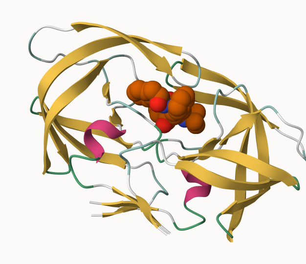
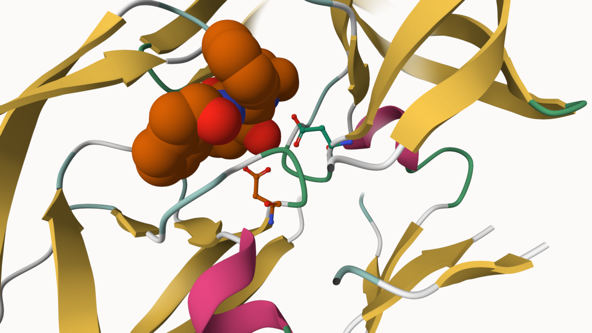

## Introduction to the RCSB Protein Data Bank (PDB)

Visit: http://www.rcsb.org/ and answer the following questions

### PDB statistics

```{r}
pdb <- read.csv("pdb_stats.csv")
head(pdb)
```


> Q1: What percentage of structures in the PDB are solved by X-Ray and Electron Microscopy.

```{r}
sum(pdb$X.ray + pdb$EM) / sum(pdb$Total) * 100
```


> Q2: What proportion of structures in the PDB are protein?

```{r}
sum(pdb$Total[grepl("Protein", pdb$Molecular.Type)]) / sum(pdb$Total)
```


> Q3: Type HIV in the PDB website search box on the home page and determine how many HIV-1 protease structures are in the current PDB?
>
> > 1227

## Visualizing the HIV-1 protease structure



### Delving deeper



## Introduction to Bio3D in R

```{r}
library(bio3dview)
library(bio3d)
```

### 
Reading PDB file data into R

```{r}
pdb <- read.pdb("1hsg")
pdb
```

> Q7. How many amino acid residues are there in this pdb object?
>
> > 198

> Q8. Name one of the two non-protein residues?
>
> > HOH, MK1

> Q9. How many protein chains are in this structure?
>
> > 2

```{r}
attributes(pdb)
```
```{r}
head(pdb$atom)
```

### Quick PDB visualization in R

```{r}
head(pdbseq(pdb))

library(NGLVieweR)

view.pdb(pdb)
view.pdb(pdb, colorScheme="sse", backgroundColor="black")
```

Lets highlight thee active site ASP, the two chains, and the ligands

```{r}
active.site <- atom.select(pdb, resno=25)

view.pdb(pdb, 
         cols=c("red","blue"), 
         highlight = active.site,
         highlight.style = "spacefill",
         backgroundColor="grey") |>
  setRock()
```

### Let's Predict The Flexibility of A Given Structure

Let's do a Normal Mode Analysis (NMA) to predict the flexibility of a pdb object

```{r}
adk <- read.pdb("6s36")
adk
```

```{r}
m <- nma(adk)
plot(m)
```

Write out the results for viewing in Mol-star:
```{r}
mktrj(m, file="adk_m7.pdb")
```

```{r}
view.nma(m, pdb=adk)
```

## Comparative structure analysis of the ADK family

Our first step is find a sequence for this family. We will use the database ID "1ake_A" here:

```{r}
aa <- get.seq("1ake_A")
aa
```

Search for related sequences in the database

```{r}
blast <- blast.pdb(aa)
head(blast$hit.tbl)
```

```{r}
hits <- plot(blast)
```

```{r}
hits$pdb.id
```

```{r}
files <- get.pdb(hits$pdb.id, path="pdbs", split=TRUE, gzip=TRUE)
```

Align and superpose all these ADK structures

```{r}
pdbs <- pdbaln(files, fit = TRUE, exefile="msa")
```

```{r}
pdbs
```

Quick interactive structural view

```{r}
view.pdbs(pdbs)
```

PCA of all this structural data (x,y and z atom coordinates):

```{r}
pc <- pca(pdbs)
plot(pc)
```

```{r}
plot(pc, 1:2)
```

Interactive view of the PC1 captured structural differences:

```{r}
view.pca(pc)
```

```{r}
mktrj(pc, file="pc_1.pdb") 
```
